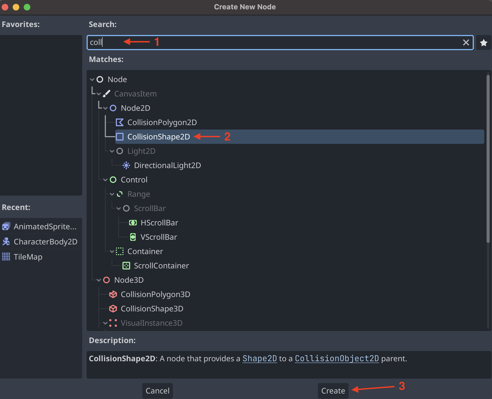
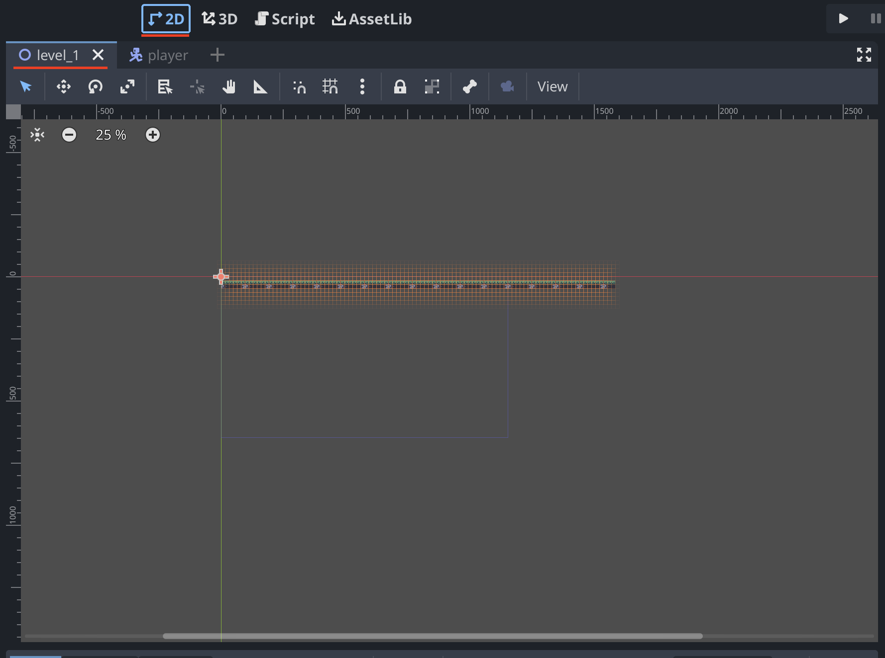

# Create a player

To create a player we need to create a new scene. To do this click on the `New Scene` button in the top left corner of the screen.


In the new scene you need to add a new `root node`. This can be done by clicking on the `plus` icon in the top left corner of the screen.


This will open a window where you can select the type of node you want to create. Here we search for `CharacterBody2D` and select the `CharacterBody2D` node. Then press the `Create` button.


Then we rename the `CharacterBody2D` by clicking on the `CharacterBody2D` node in the `scene`. 


Rename the node to `Player`. Then click on the plus icon to create an `AnimatedSprite2D`.


Search for the `AnimatedSprite2D` then click it and press `Create`.


Now rename the `AnimatedSprite2D` to `sprite`.


It should then look like this:


In the `Inspector` window find the `AnimatedSprite2D` section. Then click on `<empty>`.


Then click on `New SpriteFrames`.


It should now look like this:


To add `SpriteFrames` we need to find the editor. To do this click on the `SpriteFrames` tab at the bottom of the screen. If you can't find it click on the `sprite` in the `scene` and then click on the `SpriteFrames` tab.


To add `frames` simply drag and drop the `frames` as shown below.


It should now look like this:


Now we want to add `collision` to the `Player`. To do this click on the `Player` in the `scene` and then click on the `plus` icon.


In the pop up search for `CollisionShape2D` and click on it. Then press `Create`.



Now we need to add a `shape` to the `CollisionShape2D`. To do this find the `CollisionShape2D` section in the `Inspector` window. Then click on `<empty>`.


Now we select a `shape` in the dropdown. For this example we will use a `RectangleShape2D`.


Now we can edit the `shape` to fit our `sprite`.


Then we add a `camera` to the `scene`. This will make sure that the `camera` follows the `player` when we play the game.
To do this click on the `plus` icon in the top left corner of the screen.


In the pop up search for `Camera2D` and click on it. Then press `Create`.


It should now look like this:


We can now change the `zoom` of the `camera`. To do this click on the `Camera2D` in the `scene`. Then find the `Camera2D` section in the `Inspector` window. Then change the `zoom` for `x` and `y` to `3`.


It should now look like this:


Now we can add a `script` so we can make the player move. To do this click on the `Player` in the `scene`. Then click on the `script` icon in the top right corner.


In the pop up make sure the srcipt is called `player.gd`. Then press `Create`.


Now we should have a `script` attached to the `Player`. That looks like this:


Delete everthing in the `script` except the first line so we only have this:

```gdscript
extends CharacterBody2D
```
Code will be added later.

Now we need to save the `player scene`. To do this press `Ctrl + S` or `cmd + S` on mac. Then save the `player scene` as `player.tscn` by clicking on the `Save` button.


Now we can add the `player` to our `level`. To do the we first click on the `level_1` at the top of the screen. If the level is not there it can be found in the `FileSystem` tab. Then click on the `2D` tab at the top of the screen.



To add the `player` to the `level` we need to find the `Player` in the `FileSystem` tab.


Then drag and drop the `Player` into the `level`.


It should now look like this:


Thats it for this guide. In other guides we add more to the player.