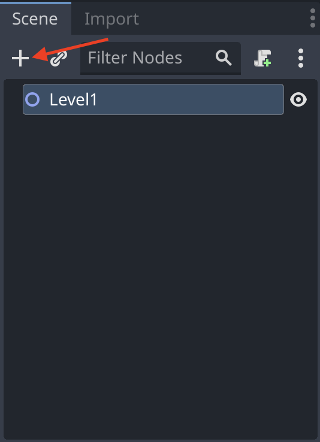
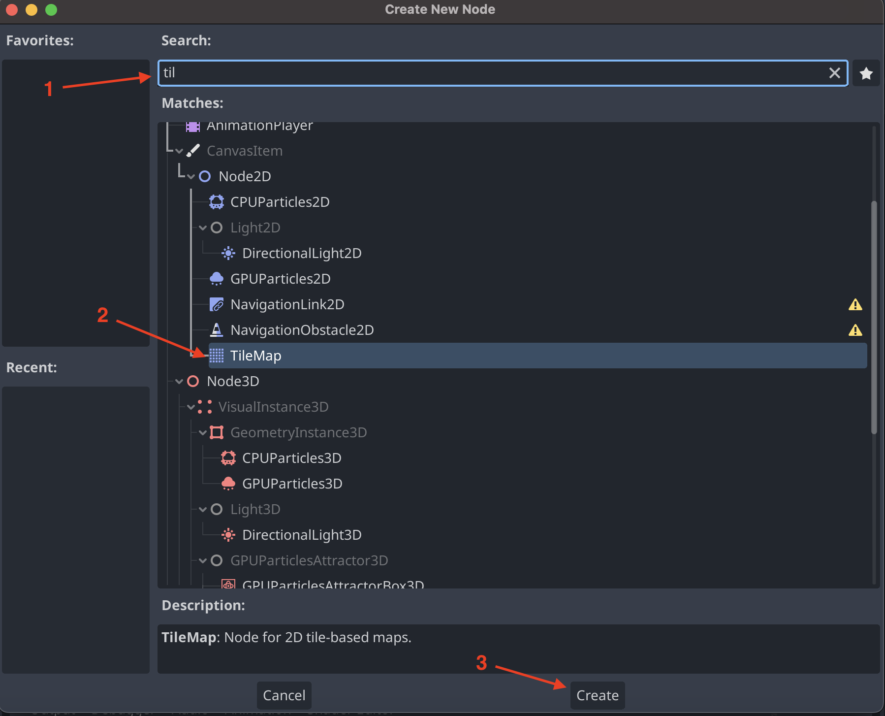

# Craete a TileMap

First click the plus icon in the top left corner of the editor. This will open a window where you can select the type of node you want to create.

In the search bar type `TileMap` and select the `TileMap` node. Then press the `Create` button.

This will create a `TileMap` node in the scene. You can now select the `TileMap` node and change its properties in the inspector.

In the inspector find the `layers` section. Then click the `Add Element` button to add a new layer. Make sure to add two new layers so there is a total of three layers. The first layer is the player layer, the second layer is the background layer and the third layer is the front layer. Set the `Z index` of the player layer to 0, the background layer to -1 and the front layer to 1. As showen below.

Now we need to add a tileset to the `TileMap`. To do this click on `<empty>` in the `TileMap` section of the inspector. This will open a dropdown where you can select a tileset. Click the `New TileSet` button to create a new tileset.

New we can enter the `TileSet` editor. Here we can add new tiles to the tileset. 

In the `FileSystem` find a `TileSet` and drag it into the `TileSet` editor. 

If a popup shows press `yes`.

If done correctly the `TileSet` editor should look like this.

Now we go into the `TileMap` editor. Here we can select the tileset we just created. On the top right of the `TileMap` editor there is a dropdown where you can select the `layer`.

Select the `Player` layer to draw in the same `layer` of the `player` we create in another guid. If you select `back` or `front` you will draw in the `background` or `front` layer.

Now we can draw by selecting the `pencil` icon in the top left corner of the `TileMap` editor. Then we choose what to draw be selecting tiles in the `TileSet` editor.

Then we can draw in the `scene` by clicking or dragging 
 in the `scene`.

