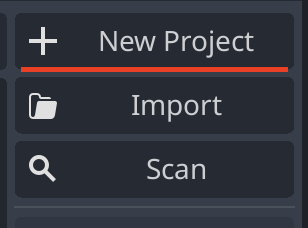
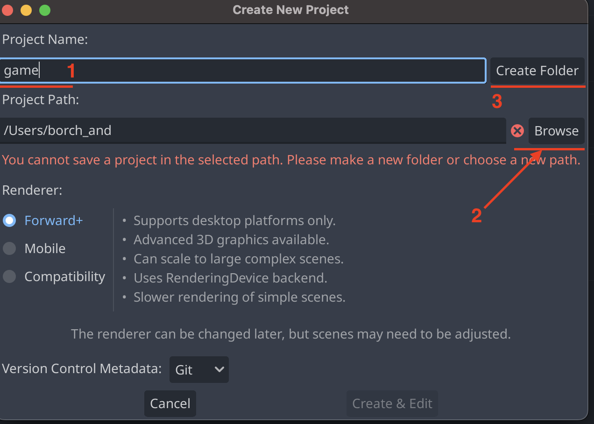
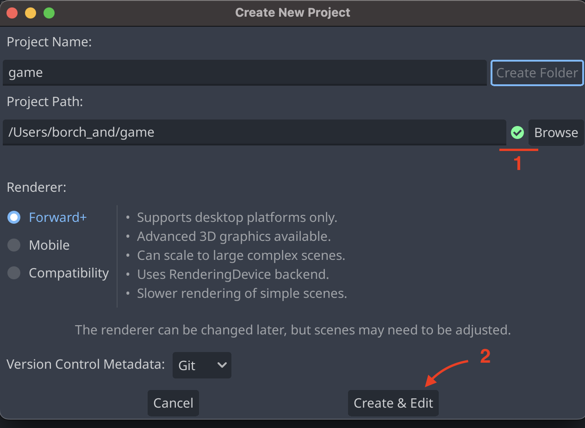
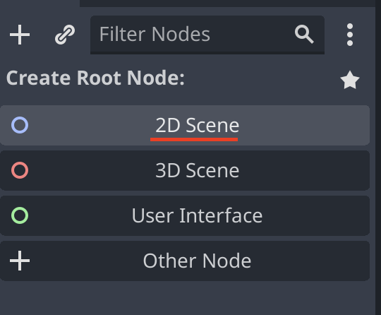

# Create a new project

To create a new project, click on the `New Project` button in the top right corner of the screen. This will open a new window where you can create the project.

1. In the opened window, you can enter the name of the project under `Project Name`.
1. You can select the directory where the project should be created under `Browse`.
1. On the right there is a button `Create Folder` which will create a folder with the same name as the project name in the selected directory.

 

1. If previous is done correctly a green checkmark will appear next to the `Browse` button.
1. You can now click on the `Create Project` button to create the project.

After the project is created, the project will be opened in the editor.
On the left you need to create a `root node` for the scene. This can be done by clicking on the `2D Scene` button in the top left corner of the screen.

